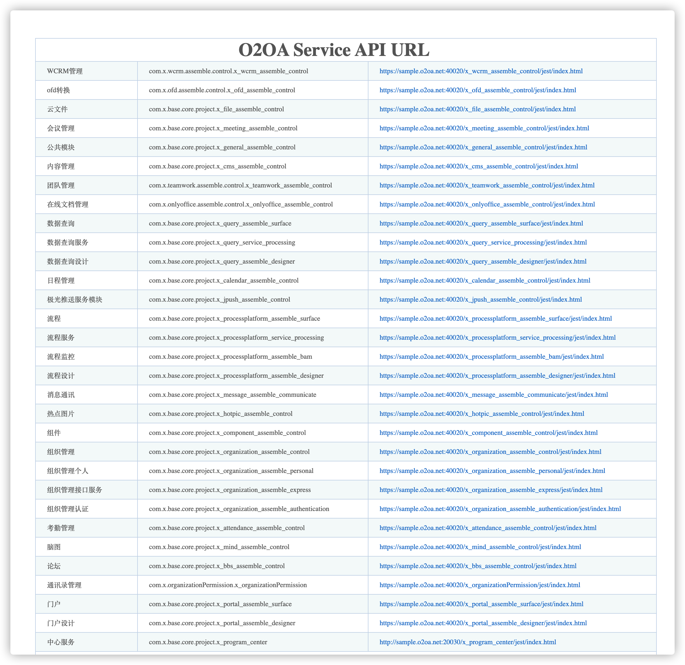
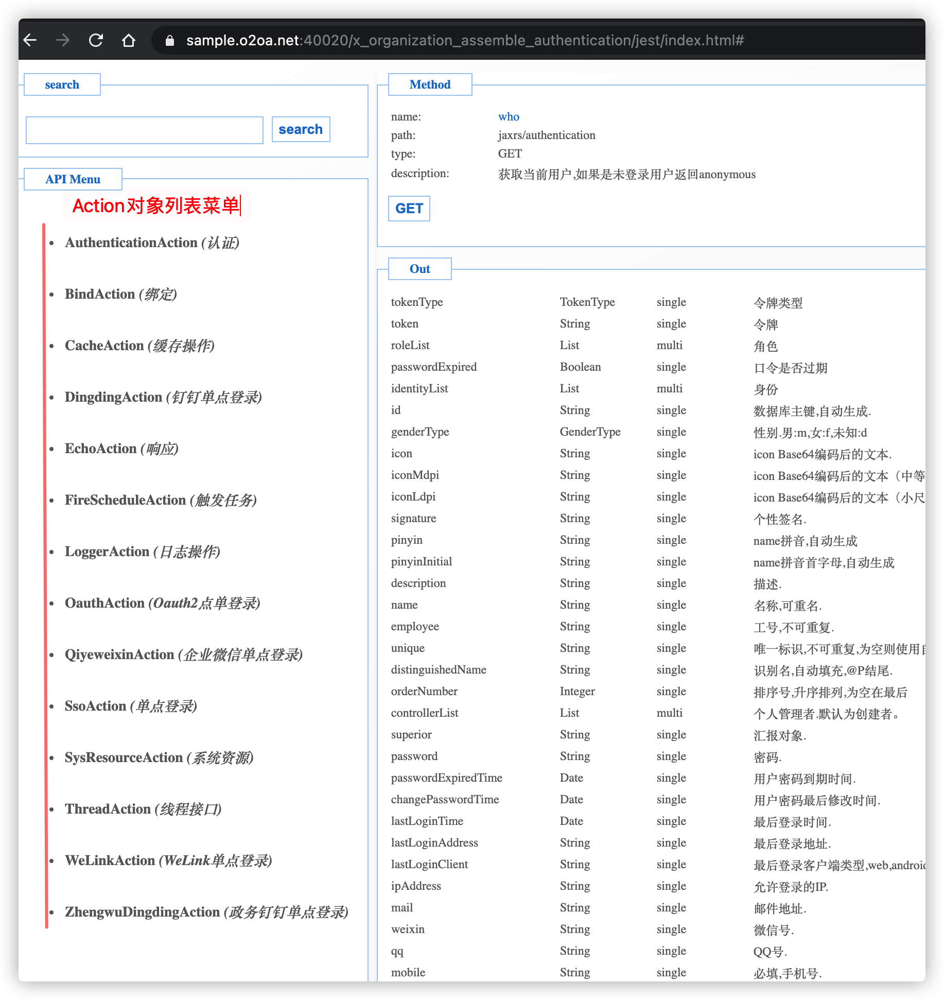
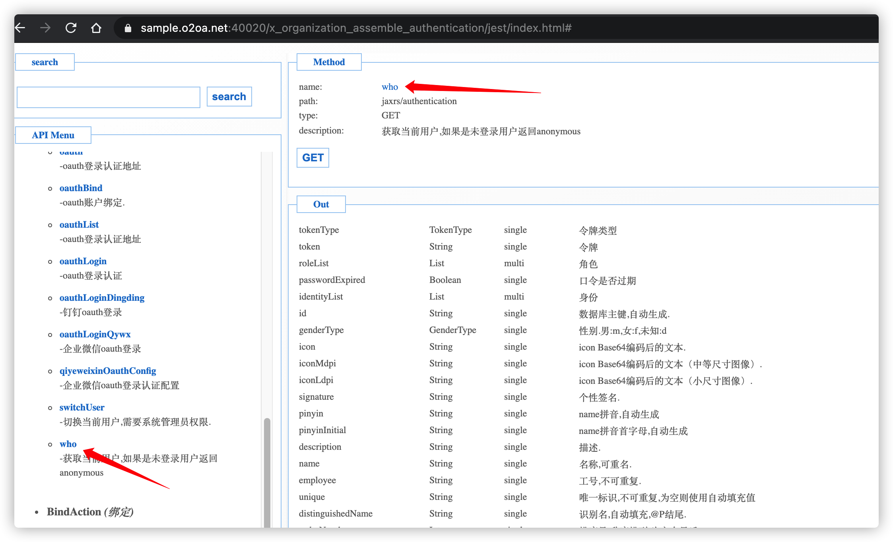
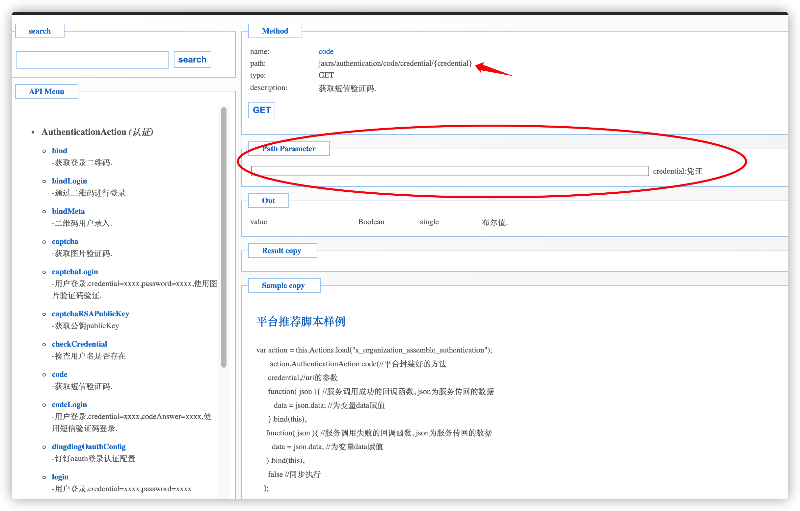
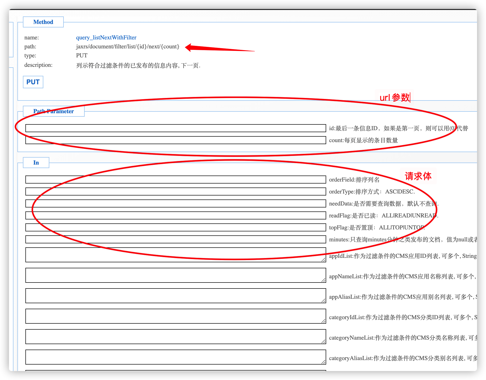

# O2OA 企业信息化办公平台 uniApp源码模版


> O2OA是基于J2EE架构，集成移动办公、智能办公，支持私有化部署，自适应负载能力的，能够很大程度上节约企业软件开发成本的基于AGPL协议开放源代码的企业信息化系统需求定制开发解决方案，对外提供专业的开发运维等技术服务。
>
> 请前往官网下载使用，官网地址：[https://www.o2oa.net/](https://www.o2oa.net/)
>
> 


## 源码说明

本项目是通过O2OA提供的接口开发的一个uniapp源码模版，为了方便unapp开发者参考开发O2OA为基础的项目而用。


### O2OA服务器地址配置

在项目模版根目录下的 `main.js` 里面有引入一个 o2.js 的工具类，然后给o2这个对象设置一个服务地址信息的数据对象，最后把o2对象设置给Vue作为属性，方便项目中全局使用。如下：

```javascript
import Vue from 'vue'
import App from './App'
import { o2 } from './common/o2.js'

Vue.config.productionTip = false
// O2OA 服务器地址端口配置
o2.o2server = {
		httpProtocol: 'http',
		centerHost: 'dd.o2oa.net',
		centerPort: 20030,//中心服务器端口
		centerContext: '/x_program_center', //中心服务器上下文
	}
	
Vue.prototype.o2 = o2


App.mpType = "app"

const app = new Vue({
    ...App
})
app.$mount()
```


### O2OA后台API如何使用

配置好上面的服务地址后就可以使用后台的API了，O2OA所有的API分模块进行列示，地址：https://sample.o2oa.net:40030/x_program_center/jest/list.html

这个地址是我们的sample服务器，如果你下载了O2OA并启动了，你可以使用你自己的地址查看，地址组成就是 **<u>http://服务器地址:中心服务端口（默认20030）/x_program_center/jest/list.html</u>**  打开看到空白页面是你没有登录或者没有管理员权限，可以用xadmin/o2 这个默认管理员登录。

api模块列表：




这里以其中的一个认证模块(x_organization_assemble_authentication)为例来说明下怎么使用。

首先需要使用o2.Actions.load方法加载模块，Promise对象返回这个模块下的所有Action列表。



然后用Action里面的具体API接口方法名直接可以调用该API进行请求返还数据了。



代码请参考 `login.vue` 页面：

```javascript
//使用 o2.Actions.load方法加载模块
this.o2.Actions.load("x_organization_assemble_authentication").then(actions=> {
  // 返回所有的这个模块下的Action对象
  var authentication = actions.AuthenticationAction
  return authentication.who() //调用who方法进行后台请求
}).then(res => { //返回请求结果
  if (res.data) {//具体的返回对象是在data属性中
     ...
  }
}).catch(err => {
  ...
})
```


#### api请求参数传入

如果API需要提交对象，比如登录接口：


```javascript
this.o2.Actions.load("x_organization_assemble_authentication").then(actions=> {
  // 返回所有的这个模块下的Action对象
  var authentication = actions.AuthenticationAction
  var body = {credential: "zhangsan", password: "123"}
  return authentication.login(body) //传入post对象
})
```


还有可能是url里面需要参数的，直接在方法中以单个属性的方式传入：



```javascript
this.o2.Actions.load("x_organization_assemble_authentication").then(actions=> {
  // 返回所有的这个模块下的Action对象
  var authentication = actions.AuthenticationAction
  return authentication.code("13022223333") //传入url参数
})
```


最后就是混合的，既有url参数又post请求体，这种情况就是先传入url参数，再传入post请求体：



```javascript
this.o2.Actions.load("x_cms_assemble_control").then(actions=> {
  // 返回所有的这个模块下的Action对象
  var docAction = actions.DocumentAction
  var id = "id参数"
  var count = 15 //count参数
  var body = {}//body请求体
  return docAction.query_listNextWithFilter(id, count, body) //参数传入顺序就是先url参数，后post请求体。参数个数根据api需要接收的参数动态计算
})
```


